# valet: Let agents use privileged tools without seeing secrets

valet is a broker between an AI agent and the tools the agent should not run
directly.

The name *valet*: it holds your keys, brings the car around, and hands you back
only what you asked for, never the keys.

The agent stays in a sandbox where it cannot read credential files like
`~/.aws`, `.env`, `.secrets`, etc. valet runs outside that sandbox, where it
can use those credentials on the agent's behalf. Before valet returns anything,
it scrubs known and suspected secret values from stdout, stderr, and the echoed
command.

In simple terms:

1. the agent asks valet to do something;
2. valet decides whether the request is allowed;
3. valet runs the approved action with the credentials available to it;
4. valet redacts sensitive values from the result;
5. the agent sees the useful result, not the sensitive info.

Benefits:

1. Safe-guard secrets while moving fast with agents
2. Keep agents light-weighted without loading apps and keys
3. Manage and audit multi-agent host access and tool usage



## Table of contents

- [Motivating examples](#motivating-examples)
  - [Example 1: Running AWS CLI commands in a hardened sandbox](#example-1-running-aws-cli-commands-in-a-hardened-sandbox)
  - [Example 2: Database query](#example-2-database-query)
- [Features](#features)
  - [Valet serve](#valet-serve)
  - [REPL mode](#repl-mode)
  - [Audit logging](#audit-logging)
- [Valet is not...](#valet-is-not)
- [Before getting started](#before-getting-started)
  - [Recommended architecture](#recommended-architecture)
  - [Sandbox hardening](#sandbox-hardening)
- [Install & run](#install--run)
  - [Interactive mode — a redacting shell](#interactive-mode--a-redacting-shell)
- [Config](#config)
  - [Choosing what to configure](#choosing-what-to-configure)
- [Guardrails](#guardrails)
- [Development](#development)
  - [Tests](#tests)

More...
- [Roadmap](./docs/ROADMAP.md)
- [Technical deep dive](./docs/TECHNICAL_DEEP_DIVE.md)


## Motivating examples

### Example 1: Running AWS CLI commands in a hardened sandbox

With a hardened Codex or Claude Code sandbox (see
[Sandbox hardening](#sandbox-hardening)), commands that need host-side
credentials should fail non-negotiably when the agent runs them directly. For
example, the AWS CLI usually needs `~/.aws/config` or `~/.aws/credentials`, but
those paths should be denied to the agent:

```bash
aws s3 ls s3://my-prod-bucket/releases/ --profile prod-readonly
```

Run through valet, the same credentialed command can succeed **without putting
credential files or secret values into model context**:

```bash
valet run -- aws s3 ls s3://my-prod-bucket/releases/ --profile prod-readonly

2026-08-04 10:12:31   18422913 app-2026-08-04T1012Z.tar.gz
2026-08-04 10:18:44        512 app-2026-08-04T1012Z.sha256
2026-08-04 11:03:09   18425102 app-2026-08-04T1103Z.tar.gz
2026-08-04 11:09:02        512 app-2026-08-04T1103Z.sha256
...
```

Other good valet-shaped commands are credentialed, read-only operational
lookups whose useful signal is not the secret itself:

```bash
valet run -- aws cloudformation list-stacks --profile prod-readonly

{
    "StackSummaries": [
        {
            "StackId": "[REDACTED:arn]",
            "StackName": "my-stack",
            "CreationTime": "2026-07-18T05:36:45.760000+00:00",
            "StackStatus": "CREATE_COMPLETE",
            "DriftInformation": {
                "StackDriftStatus": "NOT_CHECKED"
            }
        },
        ...
```

The returned output is still useful after redaction: the agent can see release
artifact names, timestamps, sizes, and missing checksum files, while account
IDs, ARNs, access keys, emails, tokens, and configured **secret values are
scrubbed before the response reaches the agent**.

### Example 2: Database query

The same pattern applies to database diagnostics. A hardened agent sandbox
should not be able to read the `.env` or `.secrets` file that contains
`DATABASE_URL`, but a trusted host-side command can use it and return a narrow,
non-secret result:

```bash
sandbox$ valet sh 'psql "$DATABASE_URL" --csv -c \
  "select status, count(*) from jobs group by status order by status"'
```

These examples let an agent inspect deployment state, failed stack updates,
service rollout progress, recent application errors, and aggregate database
state without gaining direct access to the credentials used to make the request.
Avoid using valet as a generic secret printer or unrestricted database tunnel;
secret-value reads and broad data queries should become narrow, typed
capabilities with explicit policy and approval, not raw shell habits.

## Features

### Valet serve

`valet serve` is the normal way to make privileged tools available to a
sandboxed agent. Start it yourself in a regular terminal that has the profiles,
tokens, and environment the trusted tools already use:

```bash
valet serve
```

Leave that terminal running while the agent works. The agent still runs inside
its hardened Codex or Claude Code sandbox, where it cannot read `.env`,
`.secrets`, `~/.aws`, or other denied credential locations. When it needs the
result of an approved privileged command, it calls valet instead:

```bash
sandbox$ valet --env AWS_PROFILE=prod-readonly run -- aws s3 ls s3://my-prod-bucket/releases/
sandbox$ valet run -- psql --csv -c "select status, count(*) from jobs group by status"
```

From the user's point of view, this gives the agent useful operational output
while keeping the credential material on the trusted side of the boundary.
Valet loads the configured secret sources, runs the command, redacts the echoed
command plus stdout/stderr, and only then returns output to the agent. For
`valet run`, `valet sh`, and the REPL, safe line-oriented output streams as it
arrives; structured JSON/YAML/PEM-shaped output is buffered until valet has
enough context to redact it safely.

Use `valet serve` for day-to-day local agent sessions. Stop it with Ctrl-C when
the session is over. If a client reports that no daemon is running, start
`valet serve` again from the trusted terminal.

While `valet serve` is running it watches `config.toml` and reloads changes to
policy, redaction, audit settings, and approved LAN client identities. Listener
bind settings such as `broker.socket_path`, `[host].lan`, and `[host].listen`
are read when the server starts; restart `valet serve` after changing those.

### REPL mode

REPL (Read-Eval-Print Loop) is available to examine valet's behavior
interactively while `valet serve` is running. This is particularly useful
validating a policy.

```
$ valet
valet 0.2.0 — redacting shell. Type a command to run it; ':help' for meta-commands, ':quit' to exit.

valet> aws logs tail mystack/some-task --since 60m --profile prod-readonly

2026-08-05T04:00:17.166000+00:00 states/mystack-some-task-1/2026-08-05-04/00000000 {"details":{"roleArn":"[REDACTED:arn]"},"redrive_count":"0","id":"1","type":"ExecutionStarted","previous_event_id":"0","event_timestamp":"1785902417166","execution_arn":"[REDACTED:arn]"}
2026-08-05T04:00:17.192000+00:00 states/mystack-some-task-1/2026-08-05-04/00000000 {"details":{"name":"RunTask"},"redrive_count":"0","id":"2","type":"TaskStateEntered","previous_event_id":"0","event_timestamp":"1785902417192","execution_arn":"[REDACTED:arn]"}
2026-08-05T04:00:17.192000+00:00 states/mystack-some-task-1/2026-08-05-04/00000000 {"details":{"region":"[REDACTED:secret:h:52a3d849]","resource":"runTask.sync","resourceType":"ecs"},"redrive_count":"0","id":"3","type":"TaskScheduled","previous_event_id":"2","event_timestamp":"1785902417192","execution_arn":"[REDACTED:arn]"}
...
```

### Audit logging

Audit logging makes valet's privileged boundary inspectable after the fact.
When an agent asks valet to run something, the log helps a human
answer: who asked, what command or capability was requested, which working
directory was used, whether policy allowed or denied it, whether approval was
required, how long it ran, whether it succeeded, and how much redaction happened
before output returned to the agent.

Configure the JSON log path in `config.toml`:

```toml
[audit]
log_path = "~/.valet/audit.jsonl"
console = true
```

The file is newline-delimited JSON. Non-streaming requests append one final
JSON object. Streamed exec requests append a `phase = "started"` event as soon
as policy allows the command and the process is about to run, then append a
final event when the command finishes. When `console = true`, `valet serve` and
`valet serve-lan` also print readable server-console entries:

```text
2026-08-05T12:31:03Z INFO: codex uds allowed started aws ecs describe-services ...
2026-08-05T12:31:04Z INFO: codex uds allowed aws ecs describe-services ...
   {
     "caller": "codex",
     "transport": "uds",
     "decision": "allowed",
     "phase": null,
     "command": "aws ecs describe-services ...",
     ...
   }
```

The audit log is meant to be safe to keep. It records metadata
such as request IDs, caller identity, command shape, policy decision, exit code,
duration, byte counts, redaction counts, and fail-closed events. It should not
store raw stdout, raw stderr, credential values, or unredacted command material;
otherwise the log becomes another secret sink.

For example, an audit event might say that `codex` requested an
`aws ecs describe-services ... --profile prod-readonly` command, valet allowed
it under policy, loaded several configured secret sources, redacted six values,
and returned a zero exit code after 1.8 seconds. A denied event might say that a
command referenced `**/.env` and was refused before execution. The point is
accountability: redaction protects model context, policy controls execution,
and audit logging lets an operator reconstruct what happened without exposing
the secrets valet was built to protect.

## Valet is not...

valet sits near several popular security and agent-infrastructure products, but
it is a different layer:

| Valet is not... | What that product or layer does | How valet is different |
|---|---|---|
| **a password manager or vault like 1Password** | Stores, shares, rotates, and governs secrets for humans, services, and teams. | valet does not want to become the source of truth for secrets. It uses credentials that already exist at runtime and focuses on approved actions plus redacted results. |
| **a compute platform or sandbox runtime like Modal** | Runs code in managed infrastructure with scaling, isolation, images, jobs, and service deployment. | valet does not provide general compute. It is the broker a sandboxed agent calls when it needs a trusted tool or host-side capability. |
| **a network gateway** | Controls which networks, hosts, ports, services, or private resources a workload can reach. | valet does not primarily route packets. It decides whether a requested action may run, executes approved actions, and redacts the response before the agent sees it. |
| **an MCP proxy or tool gateway** | Mediates model access to MCP tools and can centralize tool discovery, auth, logging, and request filtering. | valet can expose or sit behind MCP-shaped tools later, but its core primitive is broader: policy-controlled host actions with secret-aware output redaction. |

Those layers are complementary. A mature deployment may use a vault for storing
credentials, a sandbox or compute runtime for the agent, a network gateway for
egress control, an MCP proxy for tool routing, and valet for the policy,
redaction, and approval boundary around privileged actions.

## Before getting started

### Recommended architecture

valet is meant to be one layer in a larger agent safety design:

1. **Sandboxed agents** — the model runs where it cannot directly read secret
   files or freely reach privileged host resources.
2. **Least-privilege credentials on the host** — the credentials available to
   the broker can do only the work the agent is meant to request.
3. **Policy** — a broker decides which actions are allowed before anything
   runs.
4. **Redaction** — every response is scrubbed before it reaches model context.
5. **Audit/approval** — sensitive or mutating actions are logged and, when
   appropriate, require a human or higher-trust approval path.

valet's current implementation focuses on **3. policy**, **4. redaction**, and
the audit part of **5. audit/approval**. Human approval flows are still future
work.

Valet relies on **1. agent sandboxes** and **2. least-privilege credentials** as
complementary layers. Those layers are the operator's responsibility. Valet can
help enforce an authorization and redaction boundary, but it cannot protect
against negligent setup, over-broad host credentials, disabled sandboxes, or
approving a dangerous action without understanding its blast radius.

**WARNING:** valet is intentionally permissive today. Raw command execution is
dangerously powerful when the host has credentials with write, delete, deploy,
or payment privileges.

### Sandbox hardening

The agent runtime should be hardened before Valet is added. Treat Valet as the
privileged broker, not as the only safety control.

**IMPROTANT**: Follow [Sandbox Hardening Guide](./docs/SANDBOX_HARDENING.md)
before installing valet!

## Install & run

### Running from the a sandbox inside the host

Install valet in the host and sandbox:

```bash
python3 -m venv .venv && . .venv/bin/activate
pip install -e .
```
(You can also use uv)

In the host,
```
cp config.example.toml config.toml     # config.toml is git-ignored
$EDITOR config.toml                     # set workspace + secret_sources
valet init                              # optional: stable redaction tags

valet serve                             # start the daemon (keep this shell open)
```

From a sandbox running in the same machine,

```bash
# Lists files in the host's workspace root
valet run -- ls
```

Run privileged commands according to host's environment:

```bash
valet repl # (or simply valet) to start REPL mode
valet run -- aws s3 ls                   # argv, no shell (exact)
valet --cwd projects/app run -- ls       # cwd without shell syntax
valet --env AWS_PROFILE=prod run -- aws s3 ls
valet sh 'aws s3 ls | grep prod'         # requires [exec] shell = true
```

`run`/`sh` print redacted stdout/stderr and exit with the command's code, so
they drop into scripts like the real command would.

### Running from a node in the local network

For trusted-LAN RPC, approve a client on the trusted host:

```bash
$ valet clients add my-ai-box
valet: added client 'my-ai-box' in ./config.toml

Client config:
[client]
id = "my-ai-box"
key = "xxxxxxxxxxxxxxxxxxxxxxxx"
default_host = "my-laptop"
reconnect_max_retries = 5
reconnect_backoff_seconds = 0.25
reconnect_backoff_max_seconds = 3.0

[hosts.my-laptop]
url = "ws://<host-lan-ip>:8766/rpc"
```

This writes a new `[identity.clients.<id>]` entry to the host's `config.toml`
and prints a client-only TOML snippet. (If the id already exists, valet asks
before rotating its key.) valet hot-reloads the config if the server is already
running.

Put the printed client config on the second machine (i.e. agent),
set `[host].lan = true` and `[host].listen` on the trusted host.

The client can then use the same commands through the default host:

```bash
valet ping
valet --env AWS_PROFILE=prod run -- aws s3 ls
valet sh 'aws s3 ls | head'
valet repl
```

You can select host with `--host` option:
```bash
valet --host my-laptop -- run ls
```

To revoke a LAN client, remove it from the trusted host config:

```bash
valet clients remove local-ai-box
```

The running `valet serve` process reloads the updated client registry
automatically.

The client config only contains host URLs and that client's identity key. Host
secret sources, redaction salts, policy, and audit settings stay in the trusted
host config. `ws://` is for trusted development LANs. (public internet relay
support belongs to the future `wss://` transport in the future development.)

WebSocket clients reconnect automatically with exponential backoff. The defaults
are conservative and can be tuned in the client-only config:

```toml
[client]
reconnect_max_retries = 5
reconnect_backoff_seconds = 0.25
reconnect_backoff_max_seconds = 3.0

[hosts.my-laptop]
# Optional per-host overrides use the same keys.
```

If the socket drops while a command is already in flight, valet reconnects for
the next prompt but does not silently replay that command.

### Interactive mode — a redacting shell

Run `valet` with no subcommand (like `python` bare) to open a prompt. **Any line
you type is run as a command**, and the output comes back redacted:

```
$ valet
valet 0.2.0 — redacting shell. Type a command to run it; ':help' for meta-commands, ':quit' to exit.
ws valet> cat .secrets
DB_PASSWORD=[REDACTED:secret:h:38673aad]
API_TOKEN=[REDACTED:secret:h:3bc13a30]
ws valet> cd projects/x-com       # cd sticks for the session
x-com valet> aws s3 ls | head     # runs in projects/x-com
x-com valet> cd ../../..          # cd: cannot cd above the workspace
x-com valet> :shell off           # run following lines as argv, not shell
x-com valet> :quit
```

The prompt shows the current directory's name. **`cd` sticks** for the session,
and is **jailed to the workspace** — `..` and symlinks can't climb above
`[exec].workspace` (a bare `cd` returns to the workspace root). A compound line
(`cd x && y`) is not intercepted: the `cd` there applies only to that
subprocess, as in a real shell. Meta-commands are `:`-prefixed (`:help`, `:cwd`,
`:shell`, `:secrets`, `:processes`, `:call`, `:quit`); everything else runs.
Use `:processes list` (or `:jobs`) to list subprocesses started by Valet, and
`:processes kill <pid>` (or `:kill <pid>`) to terminate one of them. Ctrl-D
also exits. Up/Down and Ctrl-P/Ctrl-N recall previously submitted commands.
Press Tab to complete commands from `PATH` (and shell builtins) or files from the
current directory. File candidates include a trailing `/` for directories. When
there is more than one match, valet displays them in two columns; lists taller
than the terminal are shown through `more`, where `q` returns to the prompt.

## Config

`config.toml` (never committed) sets the socket, the default workspace, and the
secret sources valet loads so it can redact their values. See
[`config.example.toml`](config.example.toml). Per command, valet also
auto-loads `.env`/`.secrets` from the command's working directory, so a
project's own secrets are redacted when you run there.

### Choosing what to configure

The knobs split into two families that do fundamentally different things:

- **`[redaction]`** — *let the command run, scrub its **output**.* (masks content)
- **`[policy]`** — *decide whether the command **runs at all**.* (blocks execution)

| Knob | What it does | Use it when | Example |
|---|---|---|---|
| `redaction.secret_sources` | Loads specific files **by absolute path** and masks their content + values in *any* command's output | You have **fixed, known** secret files that trusted tools legitimately **use** | `~/.aws/credentials` |
| `redaction.cwd_secret_files` | Same, but **by filename**, auto-loaded from **whatever dir the command runs in** | Per-**project** secrets that live in each project dir | `.env`, `.secrets` |
| `policy.deny` | Refuses a command **by program name** (`allow` reserved; empty = allow all) | You want to forbid a **whole tool** | `["curl", "rm"]` |
| `policy.deny_read_paths` | Refuses a command that **names an existing file** matching a **glob** — nothing runs | You want to flatly **ban revealing** a file's content | `["**/.env", "~/.aws/**"]` |
| `policy.enforce_workspace_reads` | Refuses existing command-line paths or an explicit `cwd` outside `[exec].workspace` | Commands should stay within one project tree | `true` |
| `audit.log_path` | Appends metadata-only JSON objects for requests; streamed execs get an immediate `started` event plus a final event | You want a durable record of what valet allowed, denied, or rejected | `~/.valet/audit.jsonl` |

By default, `[exec].shell` is `false`; `valet sh`, REPL shell mode, and direct
shell executables such as `sh -c` are refused unless the host explicitly sets
`shell = true`.

**`secret_sources` vs `cwd_secret_files`** — both feed the same redactor; the
difference is only *how the file is located*. `secret_sources` is one fixed
path, masked in **every** command's output. `cwd_secret_files` is a **name**
resolved **relative to each command's cwd**, so one line covers all projects.

**`secret_sources` vs `deny_read_paths`** — the important pairing. Your
`handoff` case needs both:

| | `handoff … schedule list` (reads creds **internally**, output safe) | `cat ~/.aws/credentials` (a reveal) |
|---|---|---|
| `secret_sources = ["~/.aws/credentials"]` | ✅ runs; any leak masked | ✅ runs, content masked |
| `deny_read_paths = ["~/.aws/**"]` | ✅ runs (doesn't *name* the file) | ⛔ refused before running |

Use **`secret_sources`** for files trusted commands must **use** (keeps them
working, scrubs incidental leaks, and catches a program that opens the file
without naming it). Use **`deny_read_paths`** to flatly forbid **displaying** a
file (`cat`/`less`/`grep`) — all-or-nothing, but only for files named on the
command line. They're complementary: the ban stops the obvious `cat`, redaction
scrubs whatever slips through another way.

> **Rule of thumb:** "a command should be able to *use* this file" →
> `secret_sources` / `cwd_secret_files`. "no one should *see* this file" →
> `deny_read_paths`. "this program shouldn't run" → `policy.deny`.

## Guardrails

Valet also starts with built-in dangerous command bans for
environment/process/system-control commands such as `env`, `printenv`, `kill`,
`pkill`, `killall`, `ps`, `sudo`, `reboot`, `halt`, `launchctl`, `osascript`,
and `valet` itself.

When a command launched by Valet needs to be inspected or stopped, use Valet's
own process registry instead of host process tools:

```bash
valet processes list
valet processes kill <pid>
```

Only subprocesses started and currently tracked by Valet can be killed this way.

For per-command environment variables, prefer shell-free argv mode:

```bash
valet --env AWS_PROFILE=prod-readonly run -- aws s3 ls
```

## Development

### Tests

```bash
pip install -e ".[test]"
pytest
```

The suite covers: commands run and their output is captured; known secret
values (from `secret_sources`, cwd `.env`/`.secrets`, and `extra_values`) are
redacted from stdout and stderr; the pattern backstop masks ARNs/account
IDs/keys; nonzero exits and missing binaries are reported; unknown ops, missing
`cmd`, and bad `cwd` are rejected; the deny list blocks a command; streamed
exec output arrives as redacted chunks with structured-output buffering; audit
logging records streamed exec start and final events; and the REPL runs lines
and handles meta-commands.
